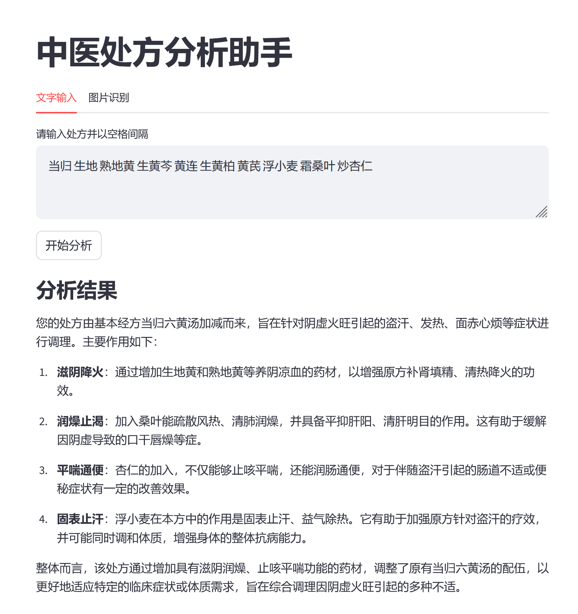
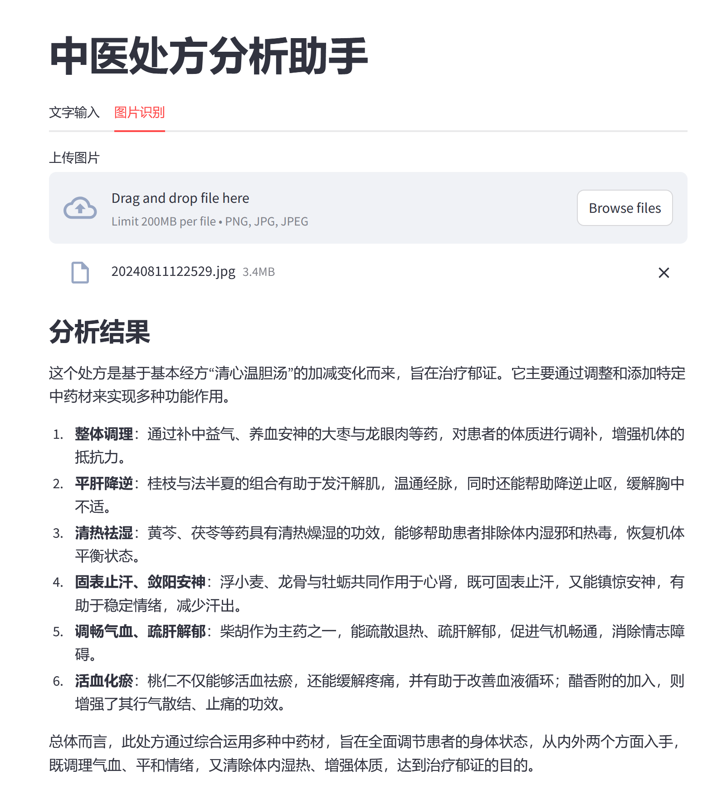

# tcm-prescription-analyzer

## 项目介绍
该项目旨在实现一个中医处方分析工具。当我们去看中医之后，我们发现很多处方都是我们不懂的，所以希望有一个工具能够帮我们分析处方的功效。
  

上述截图使用本地Qwen2-7B大模型分析生成。

## 基本实现思路
- 收集中药材数据库（herbs.json）和中药方剂数据库（formula.json），绝大部分的中药和方剂来自《神农本草经》、《本草纲目》、《伤寒论》、《金匮要略》、《太平惠民局方》等。
- 用户可以手动输入处方或者上传处方拍照。如果是上传拍照，我们会先使用ocr工具读取所有图片中的文字，再将结果交给LLM提取出所有中药材字符串。
- 当用户输入中医处方之后，首先从中药方剂数据库中寻找和用户处方拥有最大子集的方剂，我们认为它是用户处方的基本方。
- 根据查询出的基本方，再根据中医方剂加减原理从中药材数据库中找出增加的药材和减少的药材。
- 综合上述基本方功能及加减的药材功能交给LLM，得到最终的处方分析结果。

## 启动方法
- 安装依赖:
<code>pip install -r requirements</code>
- 下载ocr模型(可选):
 [下载地址](https://www.jaided.ai/easyocr/modelhub/) 
可以只下载2rd Generation Models下的中文模型和Text Detection Models模型。 
下载解压后将pth文件复制到 <code>~/.EasyOCR/model/</code> 下。
- 修改变量:
本项目中的LLM使用的是由LM Studio启动的本地服务，请根据实际情况修改config.py中的变量。
- 启动服务:
<code>streamlit run demo.py</code>

## 更新日志
- 2024.08.30: 添加了ollama支持。

## License: 
MIT